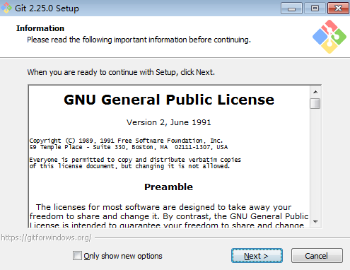
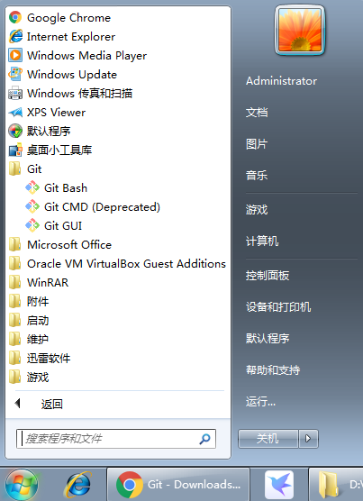
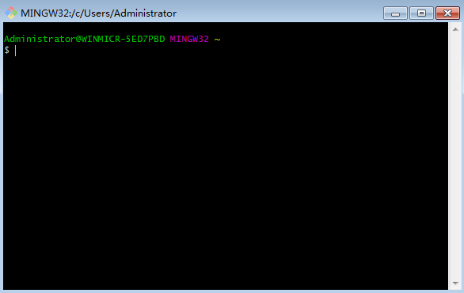
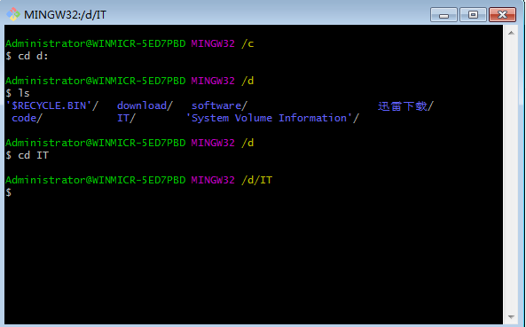
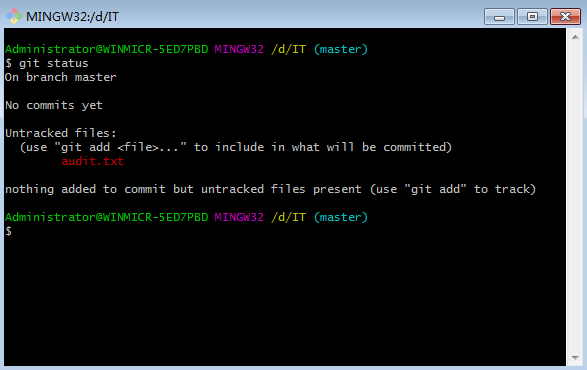
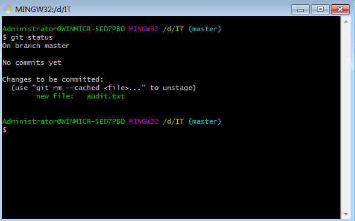
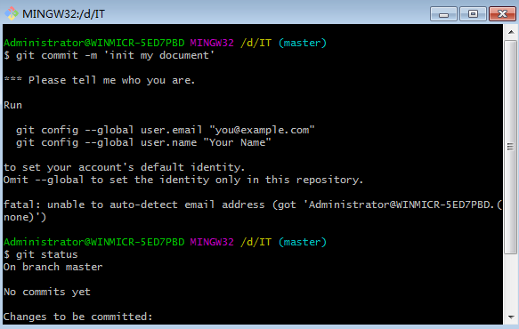
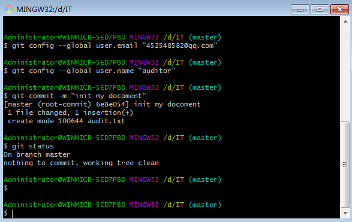

## 1.4 Git的使用

我们平时是如何管理修改文档的？很多人对于文件的管理是非常混乱的，尤其是多个人协作的时候，经常发现别人发给自己的文档居然是在之前的版本上修改的，这让人十分头疼。管理稍微好一点的，可能会给不同版本的文件名上加上类似V1、V2这样的版本信息以作区分，但时间稍微长一点就会发现自己的文件夹里存在了大量不同后缀的文件，看着并不干净整洁。

我们会想要一个工具能够记录一个文档的不同版本，我不用担心文件的丢失，当我不想要最近的修改的时候，能够方便的回退到历史版本中去。更重要的是和伙伴协作的时候，能够保证伙伴是在最新的版本基础上修改。那么有这样一个工具吗？答案是肯定的。本节我们就是要介绍Git这个版本控制工具，以及知名的远程仓库GitHub。

在学习过程中如果有任何操作的问题都可以看[《pro git（中文版）》](https://gitee.com/progit/) ，文档里有对Git的详细介绍。学会看文档也是我们学习编程路上必不可少的技能。

### 1.4.1 Git的安装

**Windows用户** 

在搜索引擎里搜索“Git”可以找到官方[下载](https://git-scm.com/downloads) 页面，如图1.4.1-1所示，选择对应操作系统的版本进行下载。
 
 

下载后安装的过程中一直点击“next”采用默认配置，如图1.4.1-2示。安装完成后在windows开始菜单里会增加一个“Git”的文件夹，如图1.4.1-3所示，点击“Git Bash”，打开命令终端，后面我们对于版本控制的操作就需要在这个终端中进行,如图.4.1-4所示。

 
 

**Ubuntu用户** 

对于Ubuntu系统的用户，可以不用上述安装过程，直接在终端里运行命令：
```Bash
sudo apt-get install git
```

**Mac用户** 

Mac和ubuntu都是类unix系统，都可以在终端里用命令安装：
```Bash
brew install git
```

## 1.4.2 建立Git仓库

现在我们安装好了Git，那么我本地有一个文件夹，我想对它进行版本控制，需要怎么做呢？

很简单我们在需要在终端里（Windows里为Git Bash)，进入到需要版本控制的文件夹，执行：
```Bash
git init
```

平时用Window的读者可能不清楚在终端里进入某个文件夹，例如，电脑D盘下有一个IT的文件夹，进入这个文件夹就执行：
```Bash
cd d:/IT
```

这里的`cd` 命令就是切换目录。如果文件夹路径比较长，我记不住怎么办？你可以通过使用`cd` 命令，再使用`ls` 命令查看当前文件目录下有哪些文件后，再使用`cd` 到你想切换的目录,如图1.4.2-1所示。

 

> 注：输入路径时可以使用Tab键补全。

当我们执行`git init` 初始化后，就会在当前文件夹下新建一个'.git'的隐藏文件夹用来存储版本控制的数据和资源。当然，现在还不会对当前文件夹下的文件进行跟踪和版本控制，只是进行了结构化框架的初始化。现在执行：

```Bash
git status
```

这个命令是使用最频繁的命令之一，作用是检查文件状态，简单点理解就是系统是否有记录文件修改，以及修改是否有提交。只有系统进行了记录，将来我们想退回到某个之前的版本才有可能。

 

为了演示方便，我新建了一个audit.txt文件，里面只有一行字符串“this is an initialtext”，运行`git status` 后，如图1.4.2-2所示，显示audit.txt未被跟踪。

如果我们想将文件纳入到版本控制就需要使用`git add` 命令跟踪这些文件：
```Bash
git add 文件名
```

这里我可以用`git add .` 添加当前文件夹下所有文件，或者只添加一个文件`git add audit.txt` 。添加完成后，我们再运行`git status` ，如图1.4.2-3所示：

 

系统告诉提示我们“changes to be committed”，意思是让我们对修改进行提交，并且对需要提交的文件进行了列示。可能第一次接触Git的读者很有疑惑，我刚刚不是已经用`git add` 对文件添加并跟踪了吗？怎么还需要我提交？

这就需要说明下Git有一个暂存区（staged）的概念，开始我们使用`git add` 只是将对文件的修改记录到了暂存区里，我们在文档的编写过程中，可能会有多次修改，通过`git add` 可以跟踪到我们每一次修改，添加到暂存区，而最后我们我们需要做一次**提交**。

```Bash
git commit -m '提交描述'
```

这里的'提交描述'是对于本次提交的版本进行简要说明，方便你自己辨识。


 

如图1.4.2-4所示，在我们执行`git commit` 后，并没有提交成功，系统反馈说：“please tell me who you are”，并让我们执行下面两条语句：
```Bash
 git config --global user.email "you@example.com"
 git config --global user.name "Your Name"
```
这是让我们设置邮箱和用户名，以此作为我们的身份标识。如图1.4.2-5所示，我们进行设置后，再执行`git commit`就能正常完成提交，再用`git status`查看状态可以发现我们成功了。

 


